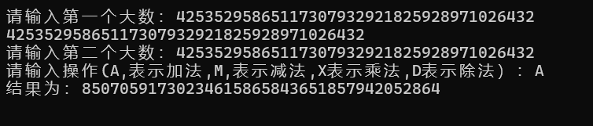
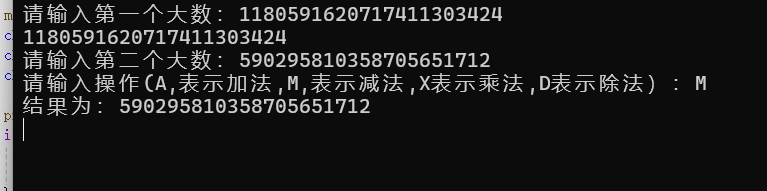
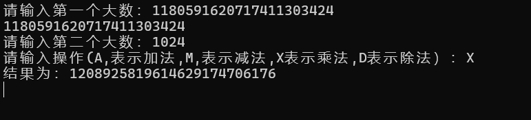
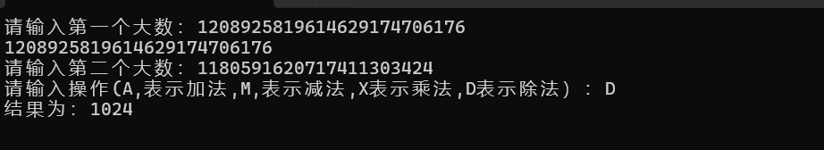

# CS-MEDIUM-01
## part 1
#### 为什么要使用字符数组来表示大数？
大数位数超过普通数据类型所能储存和表达的范围
#### 如何处理大数运算中的进位和借位问题？
可以使用另一个变量plus，来代替借位和进位
#### 如何处理负数
单独提取符号，以正数形式运算

 
       
     #include <stdio.h>  
     #include <stdlib.h>  
     #include <string.h>  

    #define MAX_SIZE 128

    int main() {
    char str1[MAX_SIZE];
    char str2[MAX_SIZE];
    printf("请输入第一个大数：");
   
        printf("%s",str1);
        return 0;
        }

### step2 实现大数加法
     

    #include <stdio.h>  
    #include <stdlib.h>  
    #include <string.h>  

    #define MAX_SIZE 100

    // maxer函数 判断str1 是否大于str2
    int maxer(char* str1, char* str2)
    {
        int len1 = strlen(str1);
        int len2 = strlen(str2);
    if (len1 > len2)
        return 1;
    else if (len1 < len2)
        return -1;
    else
    {
        int n = strcmp(str1, str2);
        if (n > 0)
            return 1;
        else if (n == 0)
            return 0;
        else if (n < 0)
            return -1;
    }
    }

    //  加法运算
    char* add(char* str1, char* str2)
    {
    //  确定较大，较小的字符串，并获取它们的长度
    int n = maxer(str1, str2);
    char* max_str = n >= 0 ? str1 : str2;
    char* min_str = n >= 0 ? str2 : str1;
    int len_max = strlen(max_str);
    int len_min = strlen(min_str);

    //  创建 较大字符串 长度大1 的空间 存储结果
    char* str =(char*)malloc((MAX_SIZE + 1)*sizeof(char));
    str[len_max + 1] = '\0'; //两个数相加无论怎样都不会超过最大的那个数进1位后的位数
    

    //  进行加法运算
    int plus = 0;        // plus 为 进位
    int i = len_max - 1; // 标记 较大字符串 最低位字符的位置（数组从0起则要减1）
    int j = len_min - 1; // 标记 较小字符串 最低位字符的位置
    for (; i >= 0; i--)
    {
        if (j >= 0)         //直到较小字符遍历完之前
        {
            str[i + 1] = max_str[i] + min_str[j] - '0' + plus; // 字符相加，位置左移 1
            j--;                                               // 较小数字位数向前(i--较大数字位数向前)
            plus = str[i + 1] > '9' ? 1 : 0;                   // 判断是否进位（两个数字相加最大进位数不会超过1）
            if (plus == 1)
                str[i + 1] -= 10; // 进位 则减 10
        }
        else // 较小字符串的字符 全部加完
        {
            str[i + 1] = max_str[i] + plus;    //同上只是不在加较小数了
            plus = str[i + 1] > '9' ? 1 : 0;
            if (plus == 1)
                str[i + 1] -= 10;
        }
    }

    //  根据 最高位 是否 进位，确定 返回指针
    if (plus == 0)
        return str + 1; // 返回 str 右移1位的位置
    else
    {
        str[0] = '1'; // str首位 赋 '1'
        return str;   // 返回 str
    }
    }

    int main() {
    char str1[MAX_SIZE];
    char str2[MAX_SIZE];
    char operation;

    printf("请输入第一个大数：");
    if (scanf_s("%s", str1, MAX_SIZE) != 1) {
        printf("输入错误！\n");
        return 1;
    }
    printf("请输入第二个大数：");
    
    if (scanf_s("%s", str2, MAX_SIZE) != 1) {
        printf("输入错误！\n");
        return 1;
    }
    printf("请输入操作(A,表示加法,M,表示减法,X表示乘法,D表示除法）：");
    getchar();
    scanf_s("%c", &operation);

    char* result;
    if (operation == 'A') {
        result = add(str1, str2);
    }
     printf("结果为：%s\n", result);

    // 注意释放动态分配的内存
    free(result);

    return 0;
}

## part 4 封装四则运算
    #include <stdio.h>
    #include <stdlib.h>
    #include <string.h>

    #define MAX_SIZE 100

    // maxer函数 判断str1 是否大于str2
    int maxer(char* str1, char* str2)   
    {
    int len1 = strlen(str1);
    int len2 = strlen(str2);
    if (len1 > len2)
        return 1;
    else if (len1 < len2)
        return -1;
    else
    {
        int n = strcmp(str1, str2);
        if (n > 0)
            return 1;
        else if (n == 0)
            return 0;
        else if (n < 0)
            return -1;
    }
    }

    //  加法运算
    char* add(char* str1, char* str2)
    {
    //  确定较大，较小的字符串，并获取它们的长度
    int n = maxer(str1, str2);
    char* max_str = n >= 0 ? str1 : str2;
    char* min_str = n >= 0 ? str2 : str1;
    int len_max = strlen(max_str);
    int len_min = strlen(min_str);

    //  创建 较大字符串 长度大1 的空间 存储结果
    char* str =(char*)malloc((MAX_SIZE + 1)*sizeof(char));
    str[len_max + 1] = '\0'; //两个数相加无论怎样都不会超过最大的那个数进1位后的位数
    

    //  进行加法运算
    int plus = 0;        // plus 为 进位
    int i = len_max - 1; // 标记 较大字符串 最低位字符的位置（数组从0起则要减1）
    int j = len_min - 1; // 标记 较小字符串 最低位字符的位置
    for (; i >= 0; i--)
    {
        if (j >= 0)         //直到较小字符遍历完之前
        {
            str[i + 1] = max_str[i] + min_str[j] - '0' + plus; // 字符相加，位置左移 1
            j--;                                               // 较小数字位数向前(i--较大数字位数向前)
            plus = str[i + 1] > '9' ? 1 : 0;                   // 判断是否进位（两个数字相加最大进位数不会超过1）
            if (plus == 1)
                str[i + 1] -= 10; // 进位 则减 10
        }
        else // 较小字符串的字符 全部加完
        {
            str[i + 1] = max_str[i] + plus;    //同上只是不在加较小数了
            plus = str[i + 1] > '9' ? 1 : 0;
            if (plus == 1)
                str[i + 1] -= 10;
        }
    }

    //  根据 最高位 是否 进位，确定 返回指针
    if (plus == 0)
        return str + 1; // 返回 str 右移1位的位置
    else
    {
        str[0] = '1'; // str首位 赋 '1'
        return str;   // 返回 str
    }
    }

    //减法运算
    char* minus(char* str1, char* str2)
    {
    //  确定结果 正负 或 0，（为1则正，为-1则负，str1表示被减数，str2表示减数）
    int  is_neg = maxer(str1, str2);

    if (is_neg == 0)
        return "0"; // 若为 0, 直接返回 "0" 结束

    char* max_str = is_neg > 0 ? str1 : str2;
    char* min_str = is_neg > 0 ? str2 : str1;
    int len_max = strlen(max_str);
    int len_min = strlen(min_str);

    char* str =(char*)malloc((MAX_SIZE + 1)*sizeof(char));
    str[len_max + 1] = '\0';
    

    //  进行减法运算
    int plus = 0; // plus 为退位
    int i = len_max - 1;
    int j = len_min - 1;    //与加法类似，从最低位开始减
    for (; i >= 0; i--)
    {
        if (j >= 0)
        {
            str[i + 1] = max_str[i] - min_str[j] + '0' + plus; // 字符相减，‘0’补足字符
            j--;
            plus = str[i + 1] < '0' ? -1 : 0; // 是否 退位
            if (plus == -1)
                str[i + 1] += 10; // 退位 则加 10
        }
        else
        {
            str[i + 1] = max_str[i] + plus;
            plus = str[i + 1] < '0' ? -1 : 0;
            if (plus == -1)
                str[i + 1] += 10;
        }
    }

    //  确定最后一个 前位0 的位置，默认 str首位 为'0'，因为计算过程统一把结果后移动了一位
    int n_zero = 0;
    for (int i = 1; i <= len_max; i++)
    {
        if (str[i] != '0')
            break;
        n_zero++;            //到不等于0的位置的时候，i=n_zero，因为此时n_zero不执行
                             //最后一轮，而执行了的每一轮n_zero都比i先++
    }

    //  根据 正负 和 最后一个前位0的位置 确定 返回指针
    if (is_neg < 0)
    {
        str[n_zero] = '-';   // 将最后一个前置0的 赋为 '-'（后移动一位后str[n_zero] 即为需要位数）
        return str + n_zero; // 返回'-'的位置（若n_zero=2，str+n_zero本应返回str字符数组从第三个字符开头的数，
    }                         //但因为上面的程序统一把数据往后移动了一位，则这里str+n_zero即为需要）

    else
        return str + n_zero + 1; // 返回最后一个前置0 右移1位的位置
}

    //乘法运算
    char* mult(char* str1, char* str2)
    {
    // 判断 str1 和 str2 中是否为 0,若有, 返回 "0" 结束
    if (*str1 == '0' || *str2 == '0')
        return "0";

    // 以较小数循环，减少循环次数，提高效率
    int n = maxer(str1, str2);
    char* max_str = n > 0 ? str1 : str2;
    char* min_str = n > 0 ? str2 : str1;
    int len_min = strlen(min_str);

    // 进行乘法运算
    char* str_sum = "0";
    // str2每个字符乘str1
    for (int i = 0; i < len_min; i++)
    {
        char* str = "0";  
        int m = (int)(min_str[i] - '0'); // 把字符转成整型
        if (m == 0)
            continue;
        else
        {
            for (int j = 0; j < m; j++)
                str = add(str, max_str);
        }
        // 根据字符位数 往str后面添 '0'
        int len = strlen(str);
        for (int j = 0; j < len_min - i - 1; j++)   //例如6666*6666,6666*6000就是6666自加6遍后面再补3个0，4-0-1=3
        {
            str[len + j] = '0';
        }
        str[len + len_min - i - 1] = '\0';            
        //printf("%s\n", str);
        // 将每次得到的结果相加
        str_sum = add(str_sum, str);
        //printf("%s\n", str_sum);
    }
    return str_sum;
}
    // 除法计算
    char* divi(char* str1, char* str2)
    {
    // 解决一些特殊情况
    if (*str2 == '0')
        return " 0 不能作为除数！";
    if (maxer(str1, str2) == -1)   
        return "0";

    // 初始化 余数，被除数，除数，和结果
    char* str_mol = add(str1, "0");  // 得到 str1 副本，在后续的除法运算过程中，不会直接修改原始的被除数str1，可以确保原始数据的完整性
    char* str_divi = add(str2, "0"); // 得到 str2 副本
    char* str_sum = "0";

    // 进行除法运算
    int n = strlen(str1) - strlen(str2); //将str1和 str2 对齐，并记录移动位数 n(补0的个数)
    char* str_n = "1";
    for (int i = 0; i < n; i++)
        str_n = mult(str_n, "10");    // 得到str_divi 扩大的倍数,这也是运算的核心
    str_divi = mult(str_divi, str_n); // 实现右对齐

    for (int i = 0; i <= n; i++)
    {
        while (maxer(str_mol, str_divi) >= 0) //说明str_mol被减数一直更大的时候，都不断执行减法操作
        {
            str_mol = minus(str_mol, str_divi);
            str_sum = add(str_sum, str_n); // 将每次结果加起来
        }
        if (i < n)
            *(str_n + strlen(str_n) - 1) = '\0';       // 减数去除尾位置的 '0'
            *(str_divi + strlen(str_divi) - 1) = '\0'; // 减数去除尾位置的 '0'
        
    }
    return str_sum;
    }

    int main() {
    char str1[MAX_SIZE];
    char str2[MAX_SIZE];
    char operation;

    printf("请输入第一个大数：");
    if (scanf_s("%s", str1, MAX_SIZE) != 1) {
        printf("输入错误！\n");
        return 1;
    }
    printf("请输入第二个大数：");
    
    if (scanf_s("%s", str2, MAX_SIZE) != 1) {
        printf("输入错误！\n");
        return 1;
    }
    printf("请输入操作(A,表示加法,M,表示减法,X表示乘法,D表示除法）：");
    getchar();
    scanf_s("%c", &operation);

    char* result;
    if (operation == 'A') {
        result = add(str1, str2);
    }
    else if (operation == 'M') {
        result = minus(str1, str2);
    }
    else if (operation == 'X') {
        result = mult(str1, str2);
    }
    else if (operation == 'D') {
        result = divi(str1, str2);
    }
    else {
        printf("无效操作！\n");
        return 1;
    }

    printf("结果为：%s\n", result);

    // 注意释放动态分配的内存
    free(result);

    return 0;
    }
  
  
  